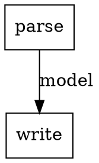

# Markup Poet — Markup DSL

A type-safe Kotlin DSL for building markup documents, written out as AsciiDoc source text. Built with Kotlin Multiplatform.

This is the **DSL poet** of the [Markup Poet](https://github.com/markup-poets) family — a growing set of markup tools ("poets") that includes [asciidoc-kmp](https://github.com/markup-poets/asciidoc-kmp), the AsciiDoc parser.

## Architecture

An abstract, format-agnostic document model composed of **sub-DSLs**, each usable standalone, plus **writer** modules that write the models as concrete markup formats:

| Module | Coordinates | Contents |
|---|---|---|
| `markup-table` | `org.markup-poet:markup-table` | standalone table model + DSL (à la picnic), zero deps |
| `markup-document` | `org.markup-poet:markup-document` | abstract document model + `article` DSL, zero deps |
| `markup-graph` | `org.markup-poet:markup-graph` | standalone graph model + DSL (nodes/edges), zero deps |
| `markup-asciidoc-writer` | `org.markup-poet:markup-asciidoc-writer` | writes the models as AsciiDoc source text |
| `markup-markdown-writer` | `org.markup-poet:markup-markdown-writer` | writes the models as Markdown (GFM) source text |
| `markup-dot-writer` | `org.markup-poet:markup-dot-writer` | writes graphs as Graphviz DOT source text |

Planned: further markup writers (e.g. DocBook) as sibling modules, and further sub-DSLs. Rendering to presentation formats (HTML, PDF) is out of scope here — that's the job of downstream tools consuming the written markup.

## Features

- **Type-safe DSL**: Describe documents in Kotlin — sections, paragraphs, code blocks, images, tables, nested lists
- **Standalone sub-DSLs**: Each sub-DSL (e.g. tables) works on its own; build and write a table without a document around it
- **Writer modules per format**: AsciiDoc and Markdown today — `toAsciidoc()` / `toMarkdown()`, `write*To(Appendable)`, `write*To(Sink)` (kotlinx-io), `*Flow(): Flow<String>` (streaming)
- **Platform independent**: JVM, Android (API 24+), iOS, Linux, macOS
- **Zero dependencies** in the model/DSL modules; writer modules use kotlinx-io and kotlinx-coroutines

## Quick Start

```kotlin
import org.markup.poet.dsl.document.article
import org.markup.poet.dsl.document.ListType
import org.markup.poet.dsl.write.asciidoc.toAsciidoc

val doc = article("Markup Poet") {
    section("Usage") {
        +"A DSL for markup documents."
        code("kotlin") {
            +"val doc = article {}"
        }
        list(ListType.ORDERED) {
            +"build"
            +"write"
        }
    }
}

println(doc.toAsciidoc())
```

produces AsciiDoc source text:

```asciidoc
= Markup Poet

== Usage

A DSL for markup documents.

[source,kotlin]
----
val doc = article {}
----

. build
. write
```

`article(title) { }` writes the title as the `=` document title and starts sections at `==`, following AsciiDoc convention. The title-less form `article { }` starts sections at `=` instead.

## Standalone sub-DSLs

Sub-DSLs work without a document. The table DSL, for example:

```kotlin
import org.markup.poet.dsl.table.table
import org.markup.poet.dsl.write.asciidoc.toAsciidoc

val t = table {
    header {
        cell("name")
        cell("value")
    }
    row("answer", "42")
}

println(t.toAsciidoc())
```

```asciidoc
|===
|name|value

| answer
| 42
|===
```

The same `table { }` builder is used inside documents via `section { table("title", "id") { ... } }`.

The graph DSL works the same way — build a graph, write it as Graphviz DOT:

```kotlin
import org.markup.poet.dsl.graph.digraph
import org.markup.poet.dsl.write.dot.toDot

val g = digraph("Pipeline") {
    node("parse") { shape = "box" }
    node("write") { shape = "box" }
    edge("parse", "write") { label = "model" }
}

println(g.toDot())
```



Render it with Graphviz: `dot -Tsvg pipeline.dot -o pipeline.svg`.

Beyond the typed style properties, arbitrary attributes pass through at graph, node, and edge level — `attr("rankdir", "LR")`, `attr("penwidth", "2")` — so the full DOT attribute vocabulary is available. And because the graph model is generic, it covers DAG/FSM-style use cases: `markup-graph` ships `Graph.isAcyclic()` and `Graph.topologicalSortOrNull()` (Kahn's algorithm, deterministic order) for directed graphs.

## Writers

Every model type gets four write forms in each writer module:

```kotlin
doc.toAsciidoc()                 // String
doc.writeAsciidocTo(appendable)  // any Appendable (StringBuilder, java.io.Writer, ...)
doc.writeAsciidocTo(sink)        // kotlinx-io Sink, UTF-8; caller flushes/closes
doc.asciidocFlow()               // cold Flow<String> of chunks, in document order;
                                 // concatenating all chunks == toAsciidoc()

doc.toMarkdown()                 // same four forms per format
doc.writeMarkdownTo(sink)
doc.markdownFlow()
```

Markdown notes (GFM): block ids become `<a id="..."></a>` anchors, table titles become a bold line, headerless tables get an empty header row, image width/height are dropped (no native syntax).

Note: depending on a writer module brings kotlinx-io and kotlinx-coroutines onto your classpath; the model/DSL modules (`markup-table`, `markup-document`) stay dependency-free.

## Building

```bash
./gradlew build                                    # full build
./gradlew :markup-table:jvmTest :markup-document:jvmTest :markup-asciidoc-writer:jvmTest
./gradlew :markup-asciidoc-writer:linuxX64Test     # native tests (Linux host)
```

## License

Licensed under the Apache License, Version 2.0. See [LICENSE](LICENSE) for details.
